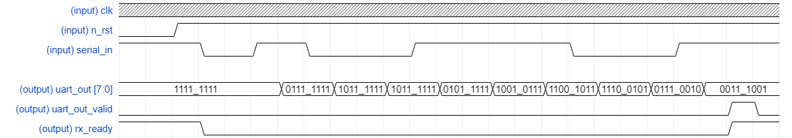
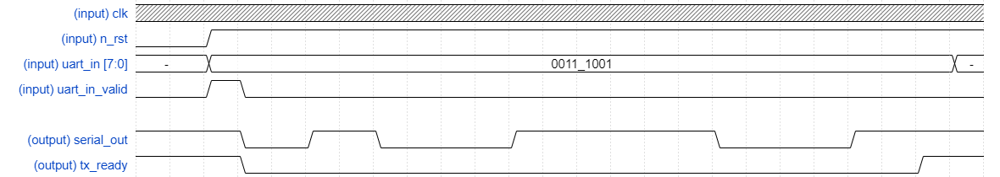

# verilog_uart_module
> ### Variable baudrate support uart module
## Dir Description
|Name|Description|Tag|    
|:---:|:---:|:---:|  
|ECHOBACK_TEST|FPGA Implementation & Echo-Back Test|Test|  
|RX| UART_Rx module design|-|  
|TX| UART_Tx module design|-|
|UART| UART integrated module desin|TOP module|    
## Specs
|Object|Number|  
|:--:|:--:|  
|CLOCK FREQ| 50MHz or Above|  
|RESET TYPE| neg-active reset|
|BAUD RATE| Variable (2400 ~ 250K)|  
|CONNECTOR TYPE| RS-232 or CP210x|  
|I/O BUFFER SIZE|8 Bit|   
|STOP BIT|1 Bit|  
|PARITY BIT|NO|     
## Module Behavior

- ### UART_RX

- ### UART_TX

